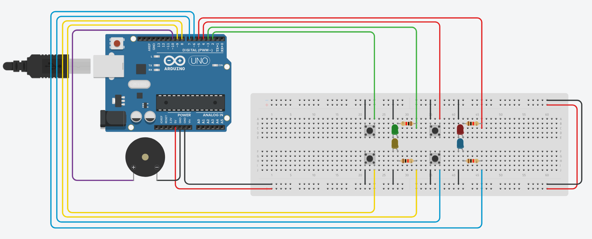

## Genius Arduino
</img>
### Info:
+ An Arduino project that aims to recreate the classic game "Genius", in which the player has to memorize a sequence of colors and then input them back.
+ Done as an assignment from a class in the Computer Science course at **PUC Minas**
### Details:
+ Circuit sketched in [TinkerCAD](https://www.tinkercad.com/), then built physically and programmed in Arduino IDE
